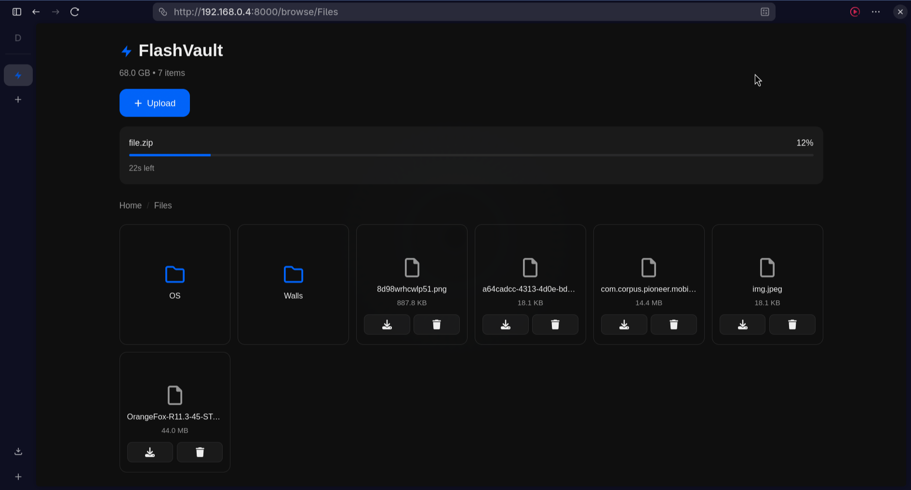

# ⚡ FlashVault

**Fast. Local. Simple.**

FlashVault is a lightweight, high-speed local file server built with Flask for fast and simple file sharing over your local network.

Browse, upload, download, and manage files from any browser — no internet required.

Perfect for quickly transferring files between your PC, phone, or other devices on the same Wi-Fi.

---

## 🚀 Features

- ⚡ High-speed local file transfers (LAN optimized)
- 📁 Browse folders and files from any browser
- ⬆️ Upload large files with real-time progress tracking
- 🎯 Drag and drop file upload support
- ⬇️ Download files instantly
- 🗑️ Delete files with confirmation
- 💾 Smart disk space management with buffer
- 🌓 Light/dark theme support (auto-detects)
- 🧭 Clean and responsive web interface
- 🧩 Minimal dependencies, easy to run

---

## 🖼️ Preview



---

## 🛠️ Installation

**Prerequisites:** Python 3.8 or newer

```bash
git clone https://github.com/madhurdhama/flashvault.git
cd flashvault
pip install flask
```

---

## 🌐 Running & Accessing

### Start the server
```bash
python3 app.py
```

### Access from any device
1. Find your server's IP address:
   - **Linux/Mac:** `hostname -i`
   - **Windows:** `ipconfig` (IPv4 Address)

2. Open browser on any device:
```
http://<your-ip>:8000
```

---

## ⚙️ Configuration

Edit `config.py` to customize:

```python
HOST = "0.0.0.0"                     # Listen on all interfaces
PORT = 8000                          # Server port
MAX_CONTENT_LENGTH = 50 GB           # Max file size per upload
MIN_FREE_SPACE = 20 GB               # Disk space buffer
```

---

## 📁 Directory Structure

```
flashvault/
├── app.py            # Main Flask application
├── config.py         # Configuration settings
├── utils.py          # Helper functions
├── static/
│   ├── css/
│   │   └── style.css
│   └── js/
│       └── app.js
├── templates/
│   └── index.html
└── preview           # UI preview images

~/FlashVault/         # Shared files directory (auto-created)
```

---

## 🧰 Tech Stack

- **Backend:** Python 3 + Flask
- **Frontend:** HTML5, CSS3, Vanilla JavaScript
- **Storage:** Local Filesystem (shutil-based)
- **Protocol:** HTTP (LAN)

---

## ⚠️ Security Notice

- Designed for **local network use only**
- No authentication by default
- Do **not** expose directly to the internet
- Use only on trusted networks
