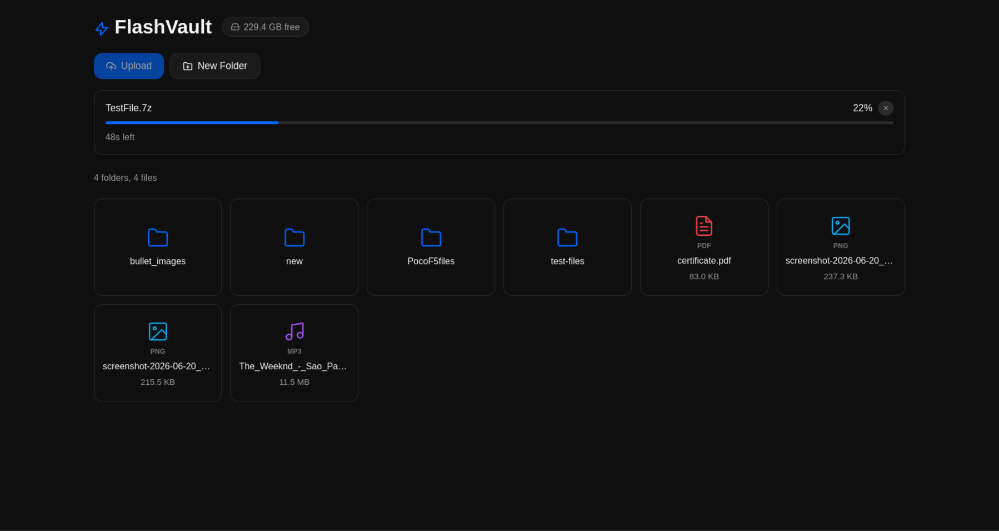

# FlashVault


A lightweight local file server built with Flask. Browse, upload, download, and manage files from any browser on your network — no internet required.

Useful for moving files between your PC, phone, or any other device on the same Wi-Fi.

---

## Features

- **Browse and manage files** — folders, rename, delete, all through modal dialogs instead of browser popups
- **Preview without downloading** — images, video, audio, PDFs, and text/code files open inline
- **Drag-and-drop upload** with a live progress bar, time remaining, and a cancel button
- **Storage-aware uploads** — checks free disk space and file size limits before and during upload, with clear error messages if either is exceeded
- **Light/dark theme** — follows your system setting automatically

---

## Preview



---

## Installation

Requires Python 3.9+.

```bash
git clone https://github.com/madhurdhama/flashvault.git
cd flashvault
pip install flask
```

---

## Running

```bash
python3 app.py
```

The terminal prints the address to open:

```
Network: http://192.168.x.x:8000
```

Open that address on any device connected to the same Wi-Fi, or use `http://localhost:8000` on the same machine.

---

## Configuration

All settings live in `config.py`:

```python
HOST = "0.0.0.0"                               # listen on all interfaces
PORT = 8000
MAX_CONTENT_LENGTH = 50 * 1024 * 1024 * 1024   # 50 GB max per file
MIN_FREE_SPACE = 20 * 1024 * 1024 * 1024       # keep 20 GB free, upload blocked below this
```

---

## Security

Built for trusted local networks only — there's no authentication on any route. Do not expose this directly to the internet. If you need remote access, put it behind a VPN (e.g. Tailscale) rather than port-forwarding.
